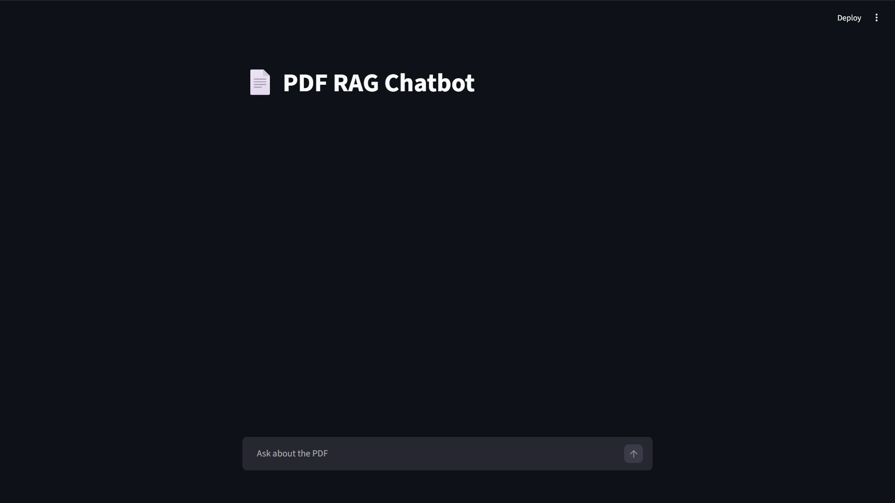

# PDF RAG Chatbot (Groq + LangChain + FAISS)

A basic Retrieval-Augmented Generation (RAG) chatbot that answers questions from a PDF using Groq LLM, HuggingFace embeddings, and FAISS vector database.

---

# Features

* Chat with any PDF
* Uses Groq LLM (fast inference)
* Local embeddings (no embedding API cost)
* Persistent FAISS vector database
* Supports both **uv** and **pip** environments

---

# Project Structure

```
pdf_chatbot/
│
├── pdf/
│   └── sample.pdf
│
├── snapshots/
│   ├── CLI.png
│   ├── main_ui.png
│   ├── vectorstore.png
│   └── sample_response.png
│
├── vectorstore/
│
├── main.py
├── streamlit_app.py
├── rag_core.py
│
├── pyproject.toml
├── README.md
└── LICENSE
```

---

# Environment Variable SetupV

Create `.env`

```
GROQ_API_KEY=your_api_key_here
```

Get key: https://console.groq.com/keys

---

# Option 1 — Run using uv (Recommended)

uv is faster and modern.

## Install uv

```
pip install uv
```

## Create environment

```
uv venv
```

## Activate environment

Windows:

```
.venv\Scripts\activate
```

Linux / Mac:

```
source .venv/bin/activate
```

## Install dependencies

If using pyproject.toml:

```
uv sync
```

OR install manually:

```
uv pip install langchain langchain-community langchain-huggingface langchain-text-splitters langchain-groq sentence-transformers faiss-cpu pypdf python-dotenv groq
```

## Run

```
uv run pdf_chatbot/app.py
```

OR

```
python pdf_chatbot/app.py
```

---

# Option 2 — Run using pip (Traditional)

## Create virtual environment

```
python -m venv venv
```

## Activate

Windows:

```
venv\Scripts\activate
```

Linux / Mac:

```
source venv/bin/activate
```

## Install dependencies

```
pip install -r requirements.txt
```

OR manually:

```
pip install langchain langchain-community langchain-huggingface langchain-text-splitters langchain-groq sentence-transformers faiss-cpu pypdf python-dotenv groq
```

## Run

```
python pdf_chatbot/app.py
```

---

# First Run Behavior

First run:

* Creates embeddings
* Creates vectorstore folder
* Takes ~10 seconds

Next runs:

* Loads vectorstore
* Starts instantly

---

# Example

```
You: what is this pdf about?

Bot: This document explains...
```
---

---

# Snapshots

## Main Interface



---

## More Screenshots

- Vectorstore Created → [View](snapshots/vector_files.png)
- CLI Interface → [View](snapshots/CLI.png)
- Sample Question Answer → [View](snapshots/sample_response.png)


---

# Tech Stack

* LangChain
* Groq
* HuggingFace sentence-transformers
* FAISS
* Python
* uv / pip

---

# Notes

vectorstore folder stores the vector database.

Do not delete unless changing the PDF.

---

# License

[MIT](LICENSE)
